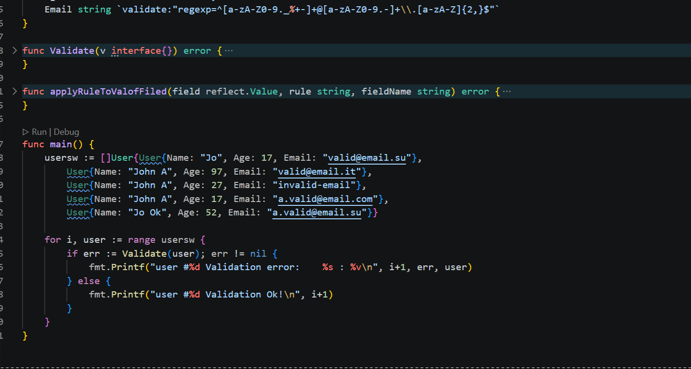

#Задание по теме «Рефлексия в Go »
применение рефлексии для создания универсального кода
 [ссылка на задание](https://netology.ru/profile/program/goprod-8/lessons/610354/lesson_items/3284610)
 ---
 
##Задание
Напишите функцию Validate(v interface{}) error, которая проверяет структуру на соответствие правилам, заданным через теги. Например:

 ```Go
type User struct {
    Name  string `validate:"min=3"`
    Age   int    `validate:"min=18;max=65"`
    Email string `validate:"regexp=^[a-zA-Z0-9._%+-]+@[a-zA-Z0-9.-]+\\.[a-zA-Z]{2,}$"`
}


---
· инициализировать модуль: go mod init validate
· установить зависимости: go mod tidy
· запустить: go run main.go



результат тестирования


